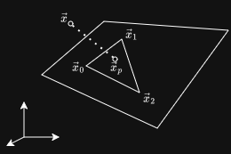
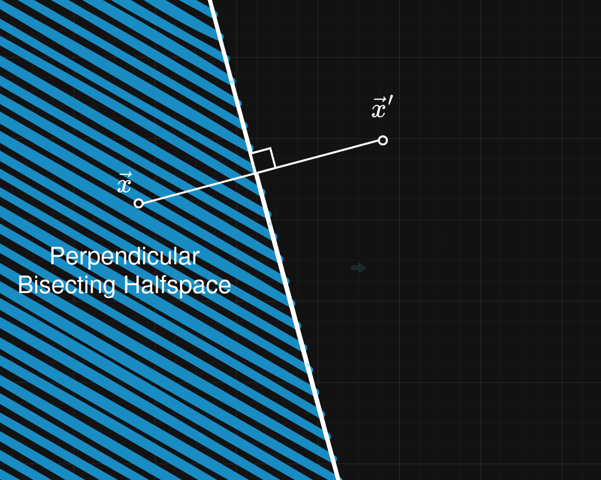
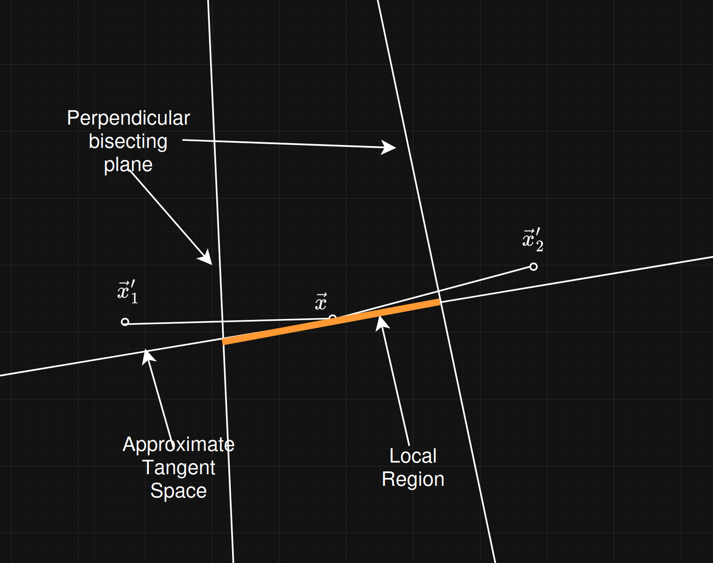

# Freedman Manifold Reconstruction from Point Cloud
This is a manifold reconstruction algorithm for manifold learning given a point set that represents samples that lie on some manifold $ \mathcal{M} \subset \mathbb{R}^n $. This repo gives the explanation and an implementation of the paper *"Efficient Simplicial Reconstructions
of Manifolds from Their Samples" - Daniel Freedman(2002)*

## Approximate Tangent Space
Enclosed: A $k$-dimensional point $x$ is said to be  enclosed by $k+1$ points if the projection of x onto the k-dimensional hyperplane running through $\{x_i\}_{i=0}^k$ is contained within the k-dimensional simplex defined by $\{x_i\}_{i=0}^k$

The hyperplane of the enclosing points is the span of the vectors representing the edges of the k-simplex $\text{span}\{\vec{x_1}-\vec{x_0}, \ldots, \vec{x_k}-\vec{x_0}\}$ so any point on the hyperplane can be represented as

$$
\vec{r} = \vec{x_0} + \sum_{i=1}^{k}\lambda_{i}(\vec{x_i} - \vec{x_0}) = \vec{x}_0 +
\begin{bmatrix}
\vec{x_1} - \vec{x_0} \\
\vdots \\
\vec{x_k} - \vec{x_0}
\end{bmatrix}
\begin{bmatrix}
\lambda_1\\
\vdots \\
\lambda_k
\end{bmatrix}
= \vec{x}_0 + \mathbf{\Omega}\vec{\lambda}
$$

So to find the projected point on the hyperplane we essentially need to find the point on the hyperplane such that the distance between $\vec{x}$ and the point hyperplane $\vec{x}_p$ is minimum i.e. solve the following problem

$$
\min_{\lambda \in \mathbb{R}^k} \left| \vec{x_0} + \sum_{i=1}^{k}\lambda_{i}(\vec{x_i} - \vec{x_0}) - \vec{x} \right|
$$
Using the least squares method we get,
$$
\left| \vec{x_0} + \sum_{i=1}^{k}\lambda_{i}(\vec{x_i} - \vec{x_0}) - \vec{x} \right|^2\\
\begin{split}
 &= (\vec{x}_0 + \mathbf{\Omega}\vec{\lambda} - \vec{x})^T(\vec{x}_0 + \mathbf{\Omega}\vec{\lambda} - \vec{x}) \\
 &= \vec{x_0}^T\vec{x_0} + \vec{x_0}^T\mathbf{\Omega}\vec{\lambda} - \vec{x_0}^T\vec{x} + \vec{\lambda}^T\mathbf{\Omega}^T\vec{x}_0 + \vec{\lambda}^T\mathbf{\Omega}^T\mathbf{\Omega}\vec{\lambda}\\ 
 & \quad - \vec{\lambda}^T\mathbf{\Omega}^T \vec{x} - \vec{x}^T\vec{x}_0 - \vec{x}^T\mathbf{\Omega}\vec{\lambda} + \vec{x}^T\vec{x}\\
 &= \vec{\lambda}^T\mathbf{\Omega}^T\mathbf{\Omega}\vec{\lambda} - (\mathbf{\Omega}^T(\vec{x} - \vec{x}_0) + (\vec{x} - \vec{x}_0)^T\mathbf{\Omega})\vec{\lambda} + (\vec{x} - \vec{x}_0)^T(\vec{x} - \vec{x}_0)
\end{split}
$$

This is a quadratic equation for which we can find the minimal solution

$$
\vec{\lambda} = \frac{1}{2}(\mathbf{\Omega}^T\mathbf{\Omega})^{-1}(\mathbf{\Omega}^T(\vec{x} - \vec{x}_0) + (\vec{x} - \vec{x}_0)^T\mathbf{\Omega})
$$

We define the **Approximate tangent space** for a local point set as the hyperplane containing $\{x_i\}_{i=0}^k$ shifted by $\vec{x} - \vec{x}_0 $ where $\{x_i\}_{i=0}^k $ is the k neighboring points of $\vec{x} $

## Local Region and Edge Set
The **perpendicular bisecting halfspace** of the point $x \in X$ with respect to the point $x' \in X$ is denoted by 
$$
PBH(x, x') = \{ z \in Z : \|z-x\| \leq \|z - x'\| \}
$$

The **local region** of $x \in X - BD$ i.e. defined by points that don't lie on the boundary given by

$$
LR(x) = \left[ \cap_{x' \in X} PBH(x, x') \right] \cap ATS(x)
$$

We can write the $ATS(x)$ and $PBH(x)$ as

$$
ATS(x) = \{z \in Z: z = \Omega_x \lambda + x, \lambda \in \mathbb{R}^k\}
$$

$$
PBH(x, x') = \{z \in Z : \langle x - x',z - \frac{1}{2}(x + x')\rangle \geq 0\}
$$

From the intersection of both, we get,

$$
\langle x - x',\Omega_x \lambda + x - \frac{1}{2}(x + x')\rangle\\
\begin{split}
&=\gamma_{x,x'}^T \lambda \geq \delta_{x, x'}\\
\end{split}
$$

Which essentially is the equation of the exterior  of the convex hull. This provides the edge set $ES(x)$ that can be used to find the most binding constraints posed by the intersecting halfspaces so, instead for taking the $PBH(x,x')$ for all $x' \in X - \{x\}$ we only we use $x \in ES(x)$ i.e. points lying on the boundary of the convex hull. This gives us the local region as 

$$
LR(x) = [\cap_{x' \in ES(x)} PBH(x, x')]\cap ATS(x)
$$

## Simplicial Complex
The simplicial complex refers to the topological structure constructed from a collection of d-simplices which is an undirected graph $G = (V, E)$. Given two vertices $x, y \in V$, an edge $e = (x, y)$ is in $E$ iff $x \in ES(y)$ and $y \in ES(x)$.